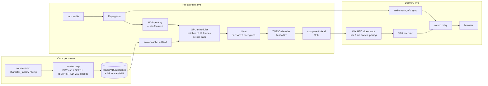

# The MuseTalk pipeline: components, and what a machine needs beyond git

This covers what every part of the MuseTalk server does, why it is there, and how much it matters. It then lists
every file a serving machine needs that is not in git, and says where each should be stored and restored from.

Snapshot of `main` at `f09b461` on the RTX 4070 SUPER box, 2026-09-30. "Live" means the WebRTC server that the
companion platform calls. "Offline" means work done once per avatar or once per GPU type.

## 1. The pipeline at a glance

In one sentence: each avatar is prepared once into per-frame face latents and blend masks. At call time, every
audio turn becomes Whisper features. The UNet turns features plus face latents into new mouth-region latents 16
frames at a time, the decoder turns those into pixels, and the CPU pastes them back into the avatar's frames. Each
call's WebRTC track then paces the frames out at 20 fps, together with the audio.

## 2. Components

For each component: what it does, why it is there, what depends on it, and where it lives. GPU and CPU mark where
the work runs.

### 2.1 Creating the avatar (upstream of MuseTalk)

| Component | What and why | Where |
|---|---|---|
| **Portrait and source video** | MuseTalk only moves the mouth region, so it needs a short video of the character to animate. The video comes from `character_factory/` (H3 three-pose, LTX, Comfy) or from `POST /avatars/generate`, which uses an OpenAI image model and then Segmind Kling motion. External APIs, not this GPU. | `character_factory/`, `scripts/avatar_generation.py` |

### 2.2 Avatar preparation (once per avatar; GPU and CPU)

Run by `POST /avatars/prepare` through `APIAvatar(preparation=True)` in `scripts/api_avatar.py`. The output is
everything the live path reuses, so no face analysis happens during a call.

| Step | What and why | Model and artifact |
|---|---|---|
| Frame extraction (CPU) | Splits the source video into frames. Frames are stored forward and then reversed (a "ping-pong" cycle), so an idle loop never jumps. | `full_imgs/*.png` |
| Face detection and landmarks (GPU) | Finds the face in every frame and builds the crop box that the UNet will repaint. Landmarks come from DWPose (68 face points); S3FD confirms that a face exists. | `models/dwpose/dw-ll_ucoco_384.pth`, `models/face_detection/s3fd.pth` → `coords.pkl` |
| Face latents (GPU) | Encodes each 256×256 face crop with the Stable Diffusion VAE. The result is 8 channels: the crop with its lower half masked out, plus a reference crop. This is the UNet's picture input, computed once per avatar instead of once per frame. | `models/sd-vae` → `latents.pt` |
| Blend masks (GPU and CPU) | BiSeNet face parsing marks the jaw and cheek region, and a blurred mask decides where generated pixels replace original ones. This gives a seamless mouth edit. | `models/face-parse-bisent/*` → `mask/*.png`, `mask_coords.pkl` |
| **Result on disk** | `results/v15/avatars/<id>/`: `avator_info.json` (the typo is in the code), `input_video.mp4`, frames, masks, `coords.pkl`, `mask_coords.pkl`, `latents.pt`. Typically 160–350 MB per avatar. | 33 avatars, 8.4 GB on this box |
| **S3 copy** | With `AVATAR_S3_ENABLED=1`, prepare uploads `s3://lingua-musetalk-s3-storage/avatars/v15/<id>.tar.gz`. A worker that lacks the avatar restores it on first use (`avatar_manager_parallel._restore_avatar_from_s3_if_needed`). | `scripts/avatar_s3_store.py` |

**Risk:** `POST /avatars/prepare` runs on the server's event loop, not in a worker thread. Preparing an avatar on a
worker that is serving calls would freeze every live stream until it finishes. `/avatars/generate` does use a thread.

### 2.3 Loading an avatar for calls (CPU and RAM)

| Component | What and why |
|---|---|
| **Avatar cache** (`scripts/avatar_cache.py`) | Keeps loaded avatars in RAM (TTL + LRU + a memory cap), so a turn never reads the disk. It is per process: the platform must send a call's requests to the worker that warmed its avatar. |
| **Warm endpoint** (`POST /avatars/{id}/cache/warm`) | Restores the avatar from S3 if needed, loads it, and with `WEBRTC_IDLE_FRAME_CACHE_WARM=1` also decodes its idle video. The control plane calls this before routing a call. |
| **Compose plans** | Per-frame paste regions and alpha masks. They are rebuilt on every load and never stored. |
| **Lean layout flags** (`MUSETALK_AVATAR_FRAME_STORE/MASK_STORE=png`, `MASK_CHANNELS=1`, `PLAN_FLOAT_ALPHA=0`) | Keep frames and masks PNG-compressed in RAM and decode them on demand. Output is bit-exact with less memory, which is what fits 15 avatars on this box. |

### 2.4 Per-turn generation (live)

| Step | What and why | Where and model |
|---|---|---|
| Upload and audio timeline (CPU, ffmpeg) | Takes the turn's audio (`POST /webrtc/sessions/{id}/stream`) and trims leading and trailing silence. The same trimmed file drives both lip-sync and playback, so they cannot drift. | `webrtc_audio_timeline.py` |
| **Whisper features** (CPU mel + GPU encoder) | Converts speech into per-frame feature windows (50×384) that the UNet reads through cross-attention. Only the Whisper *encoder* is used; nothing is transcribed. | `models/whisper` (openai/whisper-tiny), `musetalk/utils/audio_processor.py` |
| **GPU scheduler** (`scripts/hls_gpu_scheduler.py`) | One thread batches frames from every active call into GPU batches. With the r5 engines the batch is exactly 16, padded when short. This is how one GPU serves many calls: a batch of 16 is far more efficient per frame than 15 single-frame calls. Prep workers (Whisper) and compose workers (blending) run around it. | `HLS_SCHEDULER_*` |
| **UNet** (GPU) | The core model: MuseTalk v1.5, one denoising step, ~80% of GPU time. From face latents and Whisper features it produces the new mouth-region latent. Backends: • PyTorch (default, slowest) • TensorRT `.ts` bs8 (the 252 fps "BEFORE" profile) • **TensorRT stagewise bs16**: 11 per-block engines in one CUDA graph. The r2 set (350 fps) is FP16 plus 2 INT8 blocks; the **r5 set (~400 fps)** has 7 INT8 blocks chosen by error per operation. | `models/musetalkV15/unet.pth` (source weights), `models/tensorrt_unet_stagewise_sm89_srcg50` (r5, RTX 4070 SUPER only), `models/tensorrt_unet_stagewise_ampere_plus_r5` (r5 for any Ampere+ GPU), `scripts/unet_stagewise_trt.py` |
| **Decoder** (GPU) | Turns latents back into a 256×256 face. The original SD-VAE decoder is accurate but slow. **TAESD** is a tiny distilled decoder at a fraction of the cost, and its TensorRT build also produces uint8 BGR on the GPU. | `models/taesd` (weights), `models/taesd/trt/taesd_trt_6111…` (bs8 engine), `scripts/vae_fast_decoder.py` |
| **Compose / blend** (CPU, 6–10 threads) | Resizes the generated face into the crop box and alpha-blends it into the avatar frame with the mask. Fixed-point math keeps it exact and fast. | `musetalk/utils/blending.py` |
| *Chin extension / FaceMesh chin tracker* | **Offline only.** The "100% chin" recipe in the fps records was measured by the offline harness (`scripts/chin_multistream_render.py`). The live server uses the standard blend. | `character_factory/h3_avatar_workflow/chin.py`; needs mediapipe |

### 2.5 Delivery (live; CPU and network)

| Component | What and why | Where |
|---|---|---|
| **WebRTC session** | One aiortc `RTCPeerConnection` per viewer: a video track, a persistent audio track, a sync clock, and a pose router. | `scripts/webrtc_manager.py`, `api_server.py` (`/webrtc/sessions/*`) |
| **Video track** (`SwitchableVideoStreamTrack`) | Plays the avatar's idle video between turns and switches to generated frames once enough are buffered (strict FIFO, 2 s prebuffer). It paces output at 20 fps on a fixed deadline. This is the part that decides whether a viewer sees buffering. | `scripts/webrtc_tracks.py` |
| **Audio track and A/V sync** | A silent audio transport runs for the whole call. Each turn's speech is armed on it, and the first speech audio and first live video frame are released together. | `SyncedAudioStreamTrack`, `VideoSyncClock` |
| **Idle frame cache** | Decodes each avatar's idle video once per process instead of on the event loop in every session. | `scripts/webrtc_idle_frame_cache.py` |
| **Pose sets and motion bank** | Optional multi-pose avatars (resting, speaking, smiling) with optical-flow transitions. | `pose_protocol.py`, `webrtc_pose_router.py`, `webrtc_motion_playback.py` |
| **Video encoder** | **VP8 in practice.** `prefer_h264()` runs after `setRemoteDescription`, too late to apply, so the answer takes the client's first codec, VP8 for Chrome and aiortc. H.264 options (libx264, NVENC) exist but are not negotiated. A codec decision is pending. | aiortc, `webrtc_h264_override.py` |
| **TURN (coturn)** | Relays media for browsers that cannot reach the machine directly (Vast exposes only a few ports). Its relay-port range caps concurrent calls: the running coturn has 41 ports, about 11 calls when the server also relays and about 20 when only browsers do (`experiments/live15_r5/run_demo.sh`). | `scripts/run_turnserver_tcp_relay.sh`, `.env.webrtc-turn.local` |
| **The event loop** | One Python asyncio loop paces every call. Anything that holds it (GC, blocking calls, GIL-heavy threads) freezes all calls at once, and it is today's limit on concurrent calls, not the GPU. The flag-gated fixes are in `experiments/live15_r5/loopfix.env`; see `docs/fps_comparisons/live15_r5_20260929/README.md`. | `api_server.py`, `scripts/gc_tuning.py` |
| Groups and wall pages | Test pages that open N calls in one browser. | `/webrtc/groups/*`, `templates/webrtc_wall.py` |
| HLS mode | An alternative delivery mode: the same generation, with ffmpeg chunks (NVENC by default) written to a playlist. | `/hls/*` |
| Kokoro TTS | Local text-to-speech on CPU, a test aid for the wall. Real calls send their own audio. `MUSETALK_DISABLE_LOCAL_TTS=1` turns it off. | `scripts/kokoro_tts.py`, HF cache `hexgrad/Kokoro-82M` |
| Worker control plane | Registers the worker with the Lingua platform, sends heartbeats with load metrics, and supports draining. | `scripts/worker_control_plane.py` |

### 2.6 Startup and configuration

| Component | What and why | Where |
|---|---|---|
| Installer | apt packages (ffmpeg, coturn), the venv from pinned requirements, weights, the native VP8 build, and a GPU self-test. | `scripts/install_musetalk.sh`, `requirements/*.in` + `constraints-cu121.txt`, `download_weights.sh` |
| Secrets bootstrap | Reads the worker secret (`lingua/musetalk-worker-runtime` in AWS Secrets Manager) into the environment: S3 bucket names, keys, and Lingua control-plane settings. | `scripts/bootstrap_aws_secrets.py` |
| Boot script | install check → secrets → TURN → engines → server start → registration. | `scripts/vast_onstart.sh`, `scripts/vast_server_ctl.sh` |
| Resolver and recipes | Pick backends and batch sizes for the GPU. `r5` (default, nothing to set): the r5 engines from the first pinned bundle that fits the GPU (`configs/recipes/r5.env`) plus the live-tested serving levers. `fast`: `.ts` UNet if present plus TAESD. `fast300`: gated levers, all off. `legacy_int8`: the old RTX 3090 profile. Override files (`MUSETALK_ENV_OVERRIDES_FILE`) sit on top. | `scripts/musetalk_host_profile.py`, `configs/recipes/*.env`, `configs/trt_bundles/*.json`, `scripts/run_musetalk_server.sh` |
| Engine store | Builds, adopts, validates, publishes and restores TensorRT engines by fingerprint (GPU, TensorRT version). It **cannot handle the r5 set**: the source-cache layout, INT8 blocks, and r5 fails its default validation bar. | `scripts/unet_engine_store.py` |

## 3. What a machine needs that is not in git

Sizes are from this box. **Portable** works on any GPU. **GPU-bound** only works on the same GPU architecture
(sm_89 here), TensorRT version (10.3.0) and, in practice, the same driver generation.

### 3.1 Needed to serve r5

| Item | Size | Portable? | Produced by | Stored today |
|---|---|---|---|---|
| MuseTalk v1.5 UNet weights `models/musetalkV15` | 3.2 GB | yes | `download_weights.sh` (HF `TMElyralab/MuseTalk`) | re-downloaded per machine |
| SD-VAE `models/sd-vae` | 320 MB | yes | HF `stabilityai/sd-vae-ft-mse` | re-downloaded |
| Whisper-tiny `models/whisper` | 145 MB | yes | HF `openai/whisper-tiny` | re-downloaded |
| TAESD weights `models/taesd` | 5 MB | yes | HF `madebyollin/taesd` (pinned revision) | re-downloaded |
| **r5 UNet engines** | 1.1 GB per set | **GPU-bound**: the RTX 4070 SUPER set loads only there; the `AMPERE_PLUS` set loads on any GPU of compute capability 8.0-9.0 (23% slower on the 4070 SUPER) | `scripts/repro_400fps/10_build_engines.sh [--hardware-compat ampere_plus]` (20–40 min, 14 GB RAM, needs the calibration data below) | **S3**, two pinned bundles (`configs/trt_bundles/`); the default boot restores the first that fits the GPU |
| **TAESD TRT engine** `models/taesd/trt/taesd_trt_6111…` (4070 SUPER), `…_512bfd…` (any Ampere+) | 3.5 MB each | **GPU-bound** / portable | `vae_fast_decoder.py build` (~40 s) | S3, in the same bundles |
| Prepared avatars `results/v15/avatars/*` | 160–350 MB each | yes | `POST /avatars/prepare` | S3 `avatars/v15/<id>.tar.gz`, restored on first use. All 33 avatars of this box were uploaded on 2026-09-30 |
| Python venv `/workspace/.venvs/musetalk_trt_stagewise` | 9.5 GB | per CUDA and OS | installer, from pinned requirements | rebuilt per machine (~minutes) |
| Secrets (S3 keys, Lingua token) | – | – | operator | Secrets Manager (`lingua/musetalk-worker-runtime`): S3 keys yes; the `LINGUA_*` control-plane keys still need to be added (this box registers through its local `/workspace/.lingua-control-plane.env`; `docs/musetalk_worker_secrets.md`) |
| TURN password `.env.webrtc-turn.local` | – | per machine | generated at boot | local only (fine) |

### 3.2 Needed only to prepare avatars or rebuild engines

| Item | Size | Portable? | Produced by | Stored today |
|---|---|---|---|---|
| DWPose, S3FD, BiSeNet face parsing | ~570 MB | yes | `download_weights.sh`. The face-parsing weights come from a **Google Drive link** (fragile); every server start loads them too (blending), not only prepare | re-downloaded |
| **INT8 calibration data** `calibration/unet_multi_avatar_20260928` | 218 MB | yes | `scripts/build_unet_multi_avatar_corpus.py` from specific avatars and audio | S3: inside the r5 bundle, and alone as `trt-artifacts/repro-inputs/unet-multi-avatar-calibration-20260928/…`. Needed for an exact r5 rebuild |
| Quality-harness avatars `/workspace/experiments/avatar_diversity_20260927` | 763 MB | yes | external portrait and video tools | S3 `trt-artifacts/repro-inputs/avatar-diversity-20260927/…`; **cannot be regenerated**. `scripts/repro_400fps/05_fetch_inputs.sh` restores both inputs |
| FaceMesh environment (chin tracker, quality tools) | uses mediapipe from `/workspace/SoulX-FlashHead/.venv` | yes | `install_musetalk.sh --with-chin-tools` defines a proper one | borrowed from another project's venv |
| SyncNet `models/syncnet` | 1.4 GB | yes | HF `ByteDance/LatentSync` | re-downloaded; quality checks only |

### 3.3 Evidence and history (not needed to run)

| Item | Size | Stored today |
|---|---|---|
| Sign-off and comparison videos `experiments/video_validation/` | 1.4 GB | this machine only |
| Raw quality and render captures `docs/fps_comparisons/*/chin_multistream/{V_*,Q_*}` | 2.5 GB | this machine only |
| Live-test runs `tmp/live15_r5/` | 533 MB | this machine only; the summaries are in git |

### 3.4 On disk but not needed (cleanup candidates, after a backup)

| Item | Size |
|---|---|
| Old RTX 3090 engines `models/trt_downloaded_backup_20260915` (sm86; unusable here, and in S3 already) | 2.2 GB |
| Experiment engine folders (r3/r4 sets, other recipe candidates, partial builds) | ~5.4 GB |
| Unused bs32 stagewise engines | 1.6 GB |
| Duplicate S3FD copy (`models/auxiliary` = `models/face_detection`) | 86 MB |
| `.ts` bs8 UNet `models/tensorrt_unet_static_bs8_20260529` | 2.1 GB, still used by the current default launchers here |

## 4. Where each kind of artifact should live

The rule: **git for code and small inputs; S3 for anything expensive or impossible to recreate; rebuild or
re-download everything else.** Every S3 object is checksum-addressed, so a restore can verify it.

| Kind | Store in | How | Status |
|---|---|---|---|
| Code, configs, recipes, small corpora, docs | **git** | – | done |
| **TensorRT engines** (GPU-bound) | **S3 `trt-artifacts/<gpu>/<profile>/sha256-<hash>/<bundle>.tar.gz`**, the existing convention | `trt_artifact_bundle.py` format: manifest + SHA256SUMS inside, restore verifies every file. Pinned by descriptors in `configs/trt_bundles/` (URI, sha256, the hosts it fits); a portable `AMPERE_PLUS` bundle covers every Ampere+ GPU, GPU-specific bundles are faster where they exist | **done**: the RTX 4070 SUPER bundle (`sha256-8e3f4b56…`) and the portable one (`trt-artifacts/ampere-plus/r5-srcg50-int8/sha256-07644ff1…`); `docs/trt_artifacts/README.md` |
| INT8 calibration data | S3, inside the engine bundle, and as its own repro-inputs bundle | – | done |
| **Prepared avatars** | S3 `avatars/v15/<id>.tar.gz` (existing flow, restored lazily) | keep `AVATAR_S3_ENABLED=1` wherever avatars are prepared | done; all 33 local avatars uploaded 2026-09-30 |
| Base model weights (5.7 GB) | public sources + **an S3 mirror** `models/<name>/sha256-…` | the installer downloads from HF; the mirror is insurance against link rot (the Google Drive face-parsing file especially) and HF rate limits | not done (recommended) |
| Quality-harness avatars, evidence videos, raw captures | S3 archive prefix (Infrequent Access / Glacier) | one bundle per record, e.g. `evidence/4070s_400fps_20260928/…` | harness avatars **done** (`trt-artifacts/repro-inputs/avatar-diversity-20260927/…`); evidence videos and raw captures not uploaded (optional) |
| Python environments | rebuild from pinned requirements; optionally a Docker image | `install_musetalk.sh --matrix cu121` | done; an image would cut boot time |
| Secrets | AWS Secrets Manager only | `bootstrap_aws_secrets.py` | done; the static keys on this box are a local exception |
| Runtime-generated state (`.runtime/*.env`, idle frame cache, compose plans, TensorRT timing caches, `/dev/shm` arenas) | nowhere; regenerated | – | – |

**IAM:** serving machines read with `musetalk-s3-runtime`, which can read `trt-artifacts/*` but not write it (by
design). Publishing needs a separate identity with `s3:PutObject` on `trt-artifacts/*`. Today that is the
`lumatalk-root` login (`AWS_PROFILE=lumatalk-avatar-batch`).

## 5. Gaps found while writing this

Closed on 2026-09-30:

- **A fresh machine serves r5 with nothing set.** r5 is the default recipe: `scripts/vast_onstart.sh` restores the
  first bundle of `configs/recipes/r5.env`'s candidate list that fits the GPU (engine-key or compute-capability
  check, download, sha256, per-file verify, stamp) before the engine step, and the resolver serves exactly that
  bundle through the `bundle:` prerequisite. See `docs/STARTUP.md` §3-4.
- **Any Ampere-or-newer GPU runs r5**, RTX 3090 included: the portable bundle is built with TensorRT hardware
  compatibility `AMPERE_PLUS` (same ONNX, same accuracy; 307 vs 401 fps on the 4070 SUPER, so the 4070 SUPER keeps
  its own bundle). `docs/fps_comparisons/ampere_plus_r5_20260930/README.md`.
- **No `.ts` UNet is built by default** (r5 does not use it; `MUSETALK_UNET_ENGINE_PROVISION=auto` builds it).
- **The TAESD TRT engine** comes from the bundle; its G-TAESD record still reads FAIL (5 LSB against a 3 LSB bar).
  r5 was accepted as a whole on the labelled video review.
- **The trt-artifacts docs** now say the RTX 3090 restore runs only for `legacy_int8`.

Still open:

1. **`POST /avatars/prepare` blocks the event loop** (§2.2). Run it in a thread before preparing avatars on a
   serving worker.
2. **Video codec is VP8 by accident** (§2.5). This needs a decision.
3. **coturn has only 41 relay ports** (§2.5). Widen the range (`TURN_INTERNAL_RELAY_MAX_PORT`, which defaults to
   49460 in the current script) before running more than about 11 relayed calls per machine.
4. **Engines are tied to the TensorRT version** (and the GPU-specific ones to one GPU model). A TensorRT upgrade
   needs a rebuild, a re-gate and new bundles plus descriptors. Blackwell GPUs (RTX 50xx) need the cu128 stack and
   their own bundle; the r5 bundles are TensorRT 10.3 / cu121.
5. **r5 has not run on an RTX 3090 yet.** The portable plans load there by TensorRT's hardware-compatibility
   contract; the fps there is unknown, and a 3090-native bundle would likely be faster (as on the 4070 SUPER).
6. **The TAESD engine key hashes the exported ONNX**, so a different torch or ONNX exporter than the pinned
   `torch 2.5.1+cu121` changes the key; with `STRICT=1` the server then stops at startup instead of serving slower.
7. **The launchers installed on this box** (`experiments/chinese_bob_webrtc_20260927/run_local_api.sh`,
   `/workspace/run-musetalk-local-trt.sh`) still serve the `.ts` bs8 UNet; they are the user's and were not changed.

## 6. Suggested order

1. Boot one fresh RTX 3090 instance with the unchanged template: the log should show
   `r5 engine bundle ampere-plus-r5-srcg50-int8 ready` and
   `Recipe verification passed: vae=taesd_trt unet=trt_stagewise`. Measure its fps; if a 3090-native bundle is
   worth it, build one there (`docs/trt_artifacts/README.md`, "Publishing a bundle").
2. Mirror the base weights to S3.
3. Optionally archive the evidence videos and raw captures.
4. After the backups, delete the cleanup candidates in §3.4 (about 9 GB).
